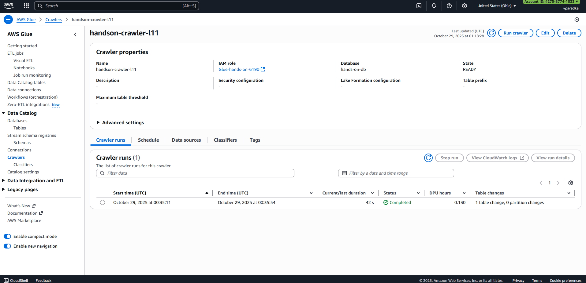
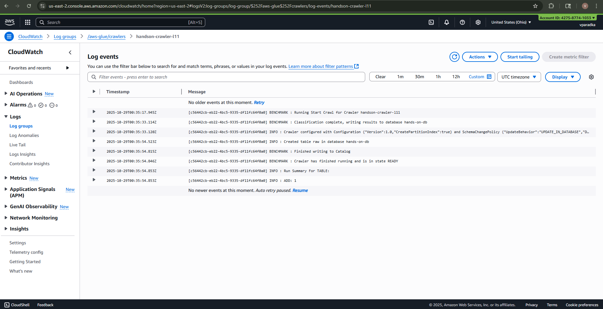
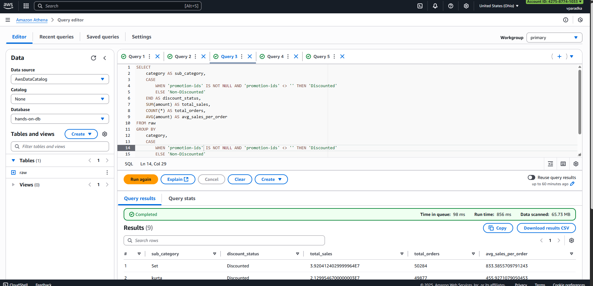
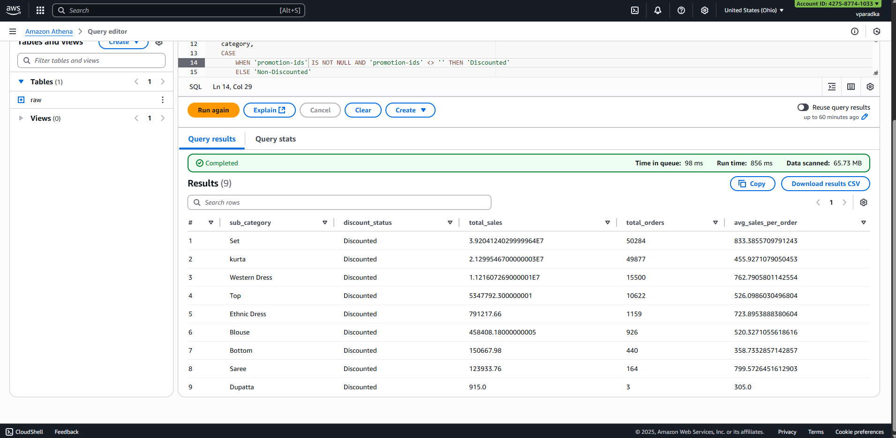
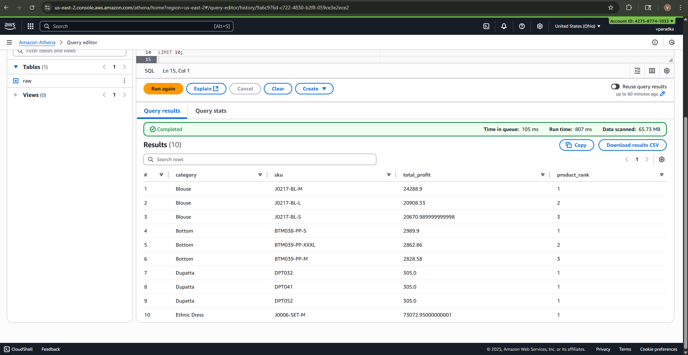
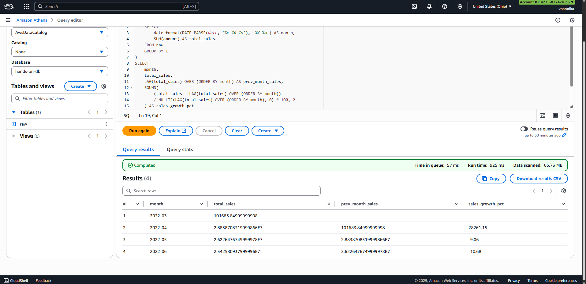

# Hands-on L11: AWS Core Services (S3, Glue, CloudWatch, Athena)

This repository contains materials for the Hands-on Lab L11 covering core AWS services used for storing, cataloging, monitoring and querying data: Amazon S3, IAM, AWS Glue (crawlers and Data Catalog), CloudWatch and Amazon Athena.

Overview
--------
This lab demonstrates how to:

- Upload raw CSV data to Amazon S3.
- Create an IAM role that grants Glue and S3 access for crawling.
- Use an AWS Glue crawler to infer schema and create tables in the AWS Glue Data Catalog.
- Inspect Glue crawler logs in CloudWatch.
- Query the data directly in S3 using Amazon Athena (with the Glue Data Catalog table).

Dataset
-------
The dataset used in this lab is the "Amazon Sale Report.csv" (source used in the lab: Kaggle). A copy of the CSV used in the exercise is included in this repo under `raw/Amazon Sale Report.csv`.

Quick structure of this repo
----------------------------
- `raw/Amazon Sale Report.csv` — raw input CSV used for the exercise
- `images/` — (optional) screenshots referenced in the example README

Steps (high level)
-------------------

1. Amazon S3

	- Log in to the AWS Management Console and open the S3 service.
	- Create a new bucket (choose a globally unique name and the desired region).
	- Inside the bucket create two folders (prefixes): `raw/` and `processed/`.
	- Upload `Amazon Sale Report.csv` into the `raw/` folder.

   

2. IAM Role for Glue

	- Open IAM in the AWS Console and create a new role.
	- Choose "AWS service" as the trusted entity and select Glue as the use case.
	- Attach the policies needed for Glue to access S3 and operate (for example: `AmazonS3FullAccess`, `AWSGlueServiceRole`, `AWSGlueConsoleFullAccess`).
	- Name and create the role; note the role ARN for later use by the crawler.

   

3. AWS Glue Crawler (create and run)

	- Open AWS Glue, go to Crawlers and click Create crawler.
	- Add a data source and select the S3 path pointing to your bucket `raw/` folder.
	- Select the IAM role created in step 2.
	- Choose or create a Glue Data Catalog database (e.g., `output_db`).
	- Finish creation, then run the crawler. The crawler will scan the CSV(s), infer schema and create a table in the selected database.

   

4. CloudWatch

	- Open CloudWatch Logs and inspect the logs created by the Glue crawler run. Glue emits logs that help diagnose schema and access problems.

   

5. Amazon Athena

	- Open Athena and configure the query results location (set to the `processed/` S3 prefix in your bucket if you want query results saved there).
	- Select the `output_db` database (or the name you used) and query the table created by the crawler using standard SQL.

   

Athena queries used
-------------------
Below are the five Athena queries used in this lab, each summarized in one sentence. The repository includes the query screenshots (`q1.png` .. `q5.png`) and their corresponding result screenshots (`q1-r.png` .. `q5-r.png`) in the `images/` folder — `q1` is the query and `q1-r` is the result, and so on.

1. Cumulative Sales Over Time — Calculates the running total of daily sales for a specific year using a cumulative sum over the parsed date field.

	
	

2. Geographic Hotspot Analysis — Identifies the states with the lowest or negative total profit by summing `amount` grouped by `"ship-state"`.

	
	

3. Discount Impact on Profitability — Compares total and average sales between discounted and non-discounted products within each category using the `"promotion-ids"` field.

	
	

4. Top 3 Most Profitable Products — Ranks products within each category by total profit and selects the top three SKUs per category using a window function.

	
	

5. Monthly Sales Growth Analysis — Aggregates total monthly sales and computes the month-over-month sales growth percentage using window functions.

	
	

Quick examples / ideas
----------------------
- Daily totals and running cumulative sums (ORDER BY date)
- Top states by profit (GROUP BY shipping state)
- Promotion vs non-promotion revenue per category
- Top N products per category (window functions and rank)
- Monthly totals and month-over-month growth

Issues encountered and resolution (important)
-----------------------------------------

During my lab work I ran into a crawler setup issue where the crawler completed but no table data appeared in the Glue Data Catalog (or Athena queries returned no data). After troubleshooting I discovered the problem was caused by a misconfigured IAM/Glue/crawler setup. The issue was resolved by:

1. Deleting the previously-created IAM role, the Glue crawler, and the related Glue resources.
2. Recreating the IAM role with the proper Glue and S3 policies attached.
3. Recreating the Glue crawler and pointing it to the correct S3 `raw/` path and selecting the correct IAM role and output database.
4. Running the new crawler — it successfully created the table and data became queryable in Athena.

If you encounter a similar "no data in database" symptom: first inspect the Glue crawler CloudWatch logs (permission/access issues or read errors show up there), and if necessary recreate IAM role + crawler ensuring the correct role is selected by the crawler.

Notes and tips
--------------
- Make sure the S3 bucket region, Glue region and your Athena region are the same.
- Ensure the IAM role you select for the crawler has S3 read permissions for the bucket and the AWS Glue service policies.
- If the crawler finds no data, check the S3 path (prefix) and verify files are readable and not zero-byte.
- Recreating resources (role and crawler) can be a quick way to clear subtle misconfigurations during a lab.

Files in this repository
------------------------
- `raw/Amazon Sale Report.csv` — the dataset used in the lab (copy placed here for convenience)

Resources
---------
- Dataset source (Kaggle): https://www.kaggle.com/datasets/thedevastator/unlock-profits-with-e-commerce-sales-data
- AWS Docs: S3, IAM, AWS Glue Crawlers, CloudWatch Logs, Amazon Athena

If you want, I can also add the exact Athena query scripts and example CSV result exports to this repo.

